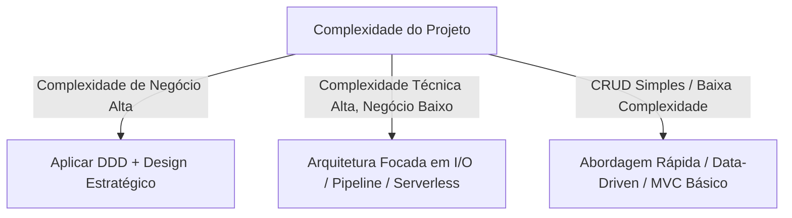
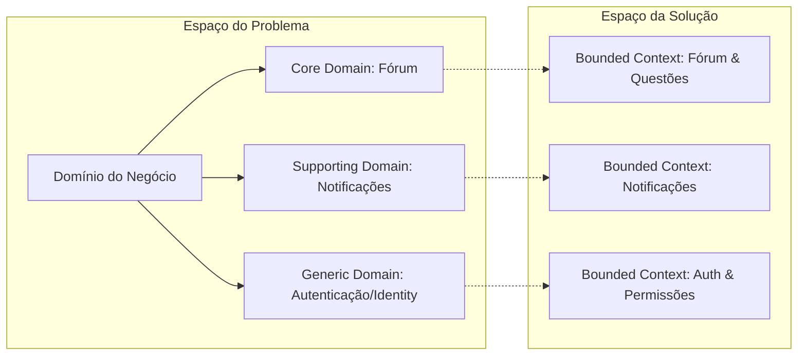
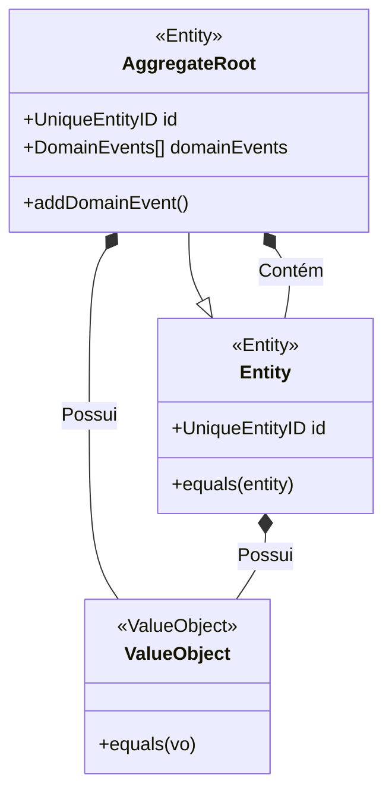
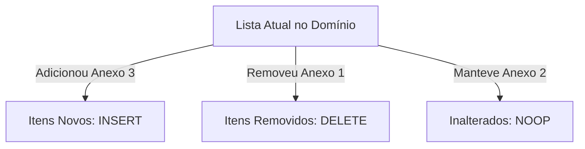
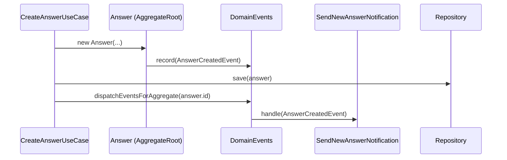

# Guia Completo: Domain-Driven Design (DDD) no TypeScript

> **Visão de Engenharia**: Domain-Driven Design não é sobre arquitetura de pastas ou padrões táticos isolados; é uma abordagem holística para o desenvolvimento de software complexo, onde a estrutura e o design do código refletem diretamente o modelo mental dos especialistas de negócio (**Domain Experts**).

---

## Sumário

1. [O que é DDD e quando aplicar?](#1-o-que-é-ddd-e-quando-aplicar)
2. [Design Estratégico (Strategic Design)](#2-design-estratégico-strategic-design)
   - [Espaço do Problema vs. Espaço da Solução](#espaço-do-problema-vs-espaço-da-solução)
   - [Domain Experts e Linguagem Ubíqua](#domain-experts-e-linguagem-ubíqua)
   - [Contextos Delimitados (Bounded Contexts)](#contextos-delimitados-bounded-contexts)
   - [Mapeamento de Contextos (Context Mapping)](#mapeamento-de-contextos-context-mapping)
   - [Classificação de Subdomínios](#classificação-de-subdomínios)
3. [Design Tático (Tactical Design & Building Blocks)](#3-design-tático-tactical-design--building-blocks)
   - [Entidades (Entities)](#entidades-entities)
   - [Objetos de Valor (Value Objects)](#objetos-de-valor-value-objects)
   - [Agregados e Raiz de Agregação (Aggregates & Aggregate Roots)](#agregados-e-raiz-de-agregação-aggregates--aggregate-roots)
   - [Coleções Observadas (Watched Lists)](#coleções-observadas-watched-lists)
   - [Repositórios (Repositories)](#repositórios-repositories)
   - [Serviços de Domínio (Domain Services)](#serviços-de-domínio-domain-services)
   - [Eventos de Domínio (Domain Events)](#eventos-de-domínio-domain-events)
   - [Casos de Uso (Use Cases / Application Services)](#casos-de-uso-use-cases--application-services)
4. [Arquitetura e Organização de Código](#4-arquitetura-e-organização-de-código)
   - [Independência de Frameworks e ORMs](#independência-de-frameworks-e-orms)
   - [Tratamento Funcional de Erros (Either / Result Pattern)](#tratamento-funcional-de-erros-either--result-pattern)
5. [Exemplos Práticos em TypeScript](#5-exemplos-práticos-em-typescript)
6. [Anti-Patterns e Armadilhas Comuns](#6-anti-patterns-e-armadilhas-comuns)
7. [Glossário Rápido](#7-glossário-rápido)

---

## 1. O que é DDD e quando aplicar?

Criado por **Eric Evans** em 2003 no livro _"Domain-Driven Design: Tackling Complexity in the Heart of Software"_, o DDD propõe colocar o foco do desenvolvimento no **coração do negócio** (o domínio), mantendo o software flexível e manutenível diante da evolução contínua das regras de negócio.

### Quando usar DDD?

- **Alta complexidade de negócio**: Aplicações com muitas regras, exceções, fluxos transacionais e invariantes estritas (ex: Plataformas Educacionais/Fóruns Acadêmicos com moderação, Sistemas Financeiros, E-commerce de grande porte).
- **Vida útil longa**: Softwares que serão mantidos e expandidos por anos por múltiplos times.
- **Domínio dinâmico**: Quando as regras de negócio mudam constantemente e precisam ser refatoradas com segurança.

### Quando NÃO usar DDD?

- **CRUDs anêmicos e simples**: Onde a aplicação serve apenas como camada de visualização direta de tabelas do banco.
- **Complexidade puramente técnica**: Drivers, ferramentas CLI de I/O puro, pipelines de ETL sem lógica de negócios complexa.



---

## 2. Design Estratégico (Strategic Design)

O design estratégico define a organização de alto nível, os limites conceituais e como os sistemas, equipes e modelos conversam entre si.



### Espaço do Problema vs. Espaço da Solução

- **Espaço do Problema**: Análise do negócio real, identificação dos subdomínios e das dores do cliente.
- **Espaço da Solução**: Como o software será estruturado em código, Bounded Contexts, microsserviços ou módulos monolíticos modulares.

### Domain Experts e Linguagem Ubíqua

- **Domain Experts**: Especialistas que dominam as regras de negócio (professores, moderadores, analistas acadêmicos, gestores).
- **Ubiquitous Language (Linguagem Ubíqua)**: Linguagem formalizada, compartilhada e sem ambiguidade entre desenvolvedores e especialistas.
  - O código **deve** falar essa linguagem (`question.chooseBestAnswer()` em vez de `db.answers.update({ is_best: true })`).
  - Se um termo muda no negócio, o modelo e as classes devem ser refatorados para refletir a mudança.

### Contextos Delimitados (Bounded Contexts)

Um termo não precisa ter a mesma definição em toda a aplicação. Dentro de um Bounded Context, cada modelo tem um significado único e estrito.

| Conceito          | Contexto do Fórum                                    | Contexto de Faturamento                              | Contexto de Autenticação                         |
| :---------------- | :--------------------------------------------------- | :--------------------------------------------------- | :----------------------------------------------- |
| **Usuário/Aluno** | Autor de perguntas, votante, respondente (`Student`) | Pagante, titular de assinatura, cliente (`Customer`) | Credencial, token JWT, salt de senha (`Account`) |
| **Conteúdo**      | `Question`, `Answer`, `Attachment`                   | `Invoice`, `ItemDeCobranca`                          | `AuditLog`                                       |

### Mapeamento de Contextos (Context Mapping)

Como diferentes Bounded Contexts se comunicam:

1. **Shared Kernel**: Modelo compartilhado por dois contextos (usar com cautela).
2. **Customer-Supplier**: O contexto fornecedor adapta dados para atender o consumidor.
3. **Conformist**: O contexto consumidor aceita o modelo do fornecedor sem modificações.
4. **Anti-Corruption Layer (ACL)**: Camada de tradução e isolamento que protege um contexto rico de modelos externos legados ou de terceiros.
5. **Open Host Service (OHS) / Published Language**: API pública padronizada (ex: REST JSON, Protobuf).

### Classificação de Subdomínios

- **Core Domain**: O diferencial competitivo do software (ex: no Academic Forum, o sistema de perguntas, respostas, moderação e reputação).
- **Supporting Domain**: Suporta o Core Domain, mas não é o diferencial competitivo (ex: sistema de upload de anexos, notificações).
- **Generic Domain**: Funcionalidades comuns a qualquer sistema (ex: Autenticação/SSO, faturamento por cartão).

---

## 3. Design Tático (Tactical Design & Building Blocks)

O design tático lida com os padrões de código e a modelagem orientada a objetos das regras de negócio.



### Entidades (Entities)

Objetos que possuem uma **identidade contínua** através do tempo.

- Duas entidades são iguais se possuírem o mesmo identificador (`ID`), mesmo que todos os outros atributos sejam diferentes.
- Devem conter **comportamento** (Rich Domain Model), nunca apenas getters e setters (`Anemic Domain Model`).

```typescript
// Exemplo: src/core/entities/entity.ts
import { UniqueEntityID } from "./unique-entity-id";

export abstract class Entity<Props> {
  private _id: UniqueEntityID;
  protected props: Props;

  get id(): UniqueEntityID {
    return this._id;
  }

  protected constructor(props: Props, id?: UniqueEntityID) {
    this.props = props;
    this._id = id ?? new UniqueEntityID();
  }

  public equals(entity: Entity<unknown>): boolean {
    if (entity === this) return true;
    if (entity.id === this._id) return true;
    return false;
  }
}
```

### Objetos de Valor (Value Objects)

Objetos definidos **exclusivamente pelos seus valores e atributos**, sem identidade própria.

- **Imutáveis**: Qualquer alteração gera uma nova instância.
- **Auto-validados**: Não existe um Value Object em estado inválido.
- **Igualdade Estrutural**: Dois VOs são iguais se seus valores internos forem idênticos.
- Exemplos: `Slug`, `Email`, `PasswordHash`, `CPF`, `Money`.

```typescript
// Exemplo: src/domain/entities/value-objects/slug.ts
export class Slug {
  public readonly value: string;

  private constructor(value: string) {
    this.value = value;
  }

  static create(value: string): Slug {
    return new Slug(value);
  }

  /**
   * Recebe uma string e a formata como um slug legível para URLs.
   * Exemplo: "Como resolver erro no Docker?" -> "como-resolver-erro-no-docker"
   */
  static createFromText(text: string): Slug {
    const slugText = text
      .normalize("NFKD")
      .toLowerCase()
      .trim()
      .replace(/\s+/g, "-")
      .replace(/[^\w-]+/g, "")
      .replace(/_/g, "-")
      .replace(/--+/g, "-")
      .replace(/-$/g, "");

    return new Slug(slugText);
  }
}
```

### Agregados e Raiz de Agregação (Aggregates & Aggregate Roots)

Um **Agregado** é um cluster de Entidades e Objetos de Valor tratados como uma **unidade atômica transacional**.

- **Aggregate Root (Raiz do Agregado)**: A entidade principal através da qual qualquer acesso ou modificação interna deve obrigatoriamente passar.
- **Regras de Ouro dos Agregados**:
  1. O mundo externo só pode ter referências diretas para a **Raiz da Agregação**.
  2. Entidades internas não podem ser acessadas/modificadas diretamente por repositórios externos.
  3. Uma transação do banco deve alterar **apenas uma Raiz de Agregação**.
  4. Garante a integridade e todas as invariantes de negócio antes de persistir.

```typescript
// Exemplo: src/domain/entities/question.ts
import { AggregateRoot } from "@/core/entities/aggregate-root";
import { Slug } from "./value-objects/slug";
import { UniqueEntityID } from "@/core/entities/unique-entity-id";
import { Optional } from "@/core/types/optional";

export interface QuestionProps {
  authorId: UniqueEntityID;
  bestAnswerId?: UniqueEntityID;
  title: string;
  content: string;
  slug: Slug;
  createdAt: Date;
  updatedAt?: Date;
}

export class Question extends AggregateRoot<QuestionProps> {
  get title() {
    return this.props.title;
  }

  get slug() {
    return this.props.slug;
  }

  get bestAnswerId() {
    return this.props.bestAnswerId;
  }

  set bestAnswerId(bestAnswerId: UniqueEntityID | undefined) {
    this.props.bestAnswerId = bestAnswerId;
    this.touch();
  }

  set title(title: string) {
    this.props.title = title;
    this.props.slug = Slug.createFromText(title);
    this.touch();
  }

  private touch() {
    this.props.updatedAt = new Date();
  }

  static create(
    props: Optional<QuestionProps, "createdAt" | "slug">,
    id?: UniqueEntityID,
  ): Question {
    const question = new Question(
      {
        ...props,
        slug: props.slug ?? Slug.createFromText(props.title),
        createdAt: props.createdAt ?? new Date(),
      },
      id,
    );

    return question;
  }
}
```

### Coleções Observadas (Watched Lists)

Como lidar com listas de entidades filhas dentro de um Agregado (ex: Lista de Anexos de uma Pergunta) garantindo rastreabilidade de adições e remoções para persistência no banco:



### Repositórios (Repositories)

Fornecem uma abstração para a coleção de agregados persistidos, operando como se todos os dados estivessem em memória.

- No DDD puro, criamos a **Interface (Port)** na camada de Domínio (`src/domain/repositories/questions-repository.ts`).
- A implementação concreta (**Adapter**) fica na camada de Infraestrutura (`src/infra/database/prisma/repositories/prisma-questions-repository.ts`).
- **Atenção**: Repositórios existem apenas para **Raízes de Agregação** (ex: não existe `QuestionAttachmentsRepository`, o salvamento ocorre via `QuestionsRepository`).

```typescript
// src/domain/repositories/questions-repository.ts
import { Question } from "../entities/question";

export interface QuestionsRepository {
  findById(id: string): Promise<Question | null>;
  findBySlug(slug: string): Promise<Question | null>;
  create(question: Question): Promise<void>;
  save(question: Question): Promise<void>;
  delete(question: Question): Promise<void>;
}
```

### Serviços de Domínio (Domain Services)

Quando uma lógica de negócio não pertence naturalmente a uma única entidade ou objeto de valor, e orquestra múltiplas entidades puramente no nível de domínio.

- **Stateless**.
- Não lida com requisições HTTP, headers ou I/O externo.

### Eventos de Domínio (Domain Events)

Notificam outros contextos ou agregados de que algo relevante para o negócio aconteceu no passado.

- Nomes no particípio passado: `QuestionCreatedEvent`, `AnswerChosenAsBestEvent`, `StudentRegisteredEvent`.
- Permitem **consistência eventual** e desacoplamento total.



### Casos de Uso (Use Cases / Application Services)

Orquestram o fluxo de execução:

1. Recebem DTOs (Data Transfer Objects).
2. Chamam o repositório para carregar o agregado.
3. Executam métodos de negócio no agregado.
4. Persistem as alterações via repositório.
5. Despacham eventos de domínio.
6. Retornam a resposta formatada.

---

## 4. Arquitetura e Organização de Código

Uma estrutura recomendada para projetos TypeScript que utilizam DDD e Clean Architecture:

```text
src/
├── core/                        # Abstrações base reutilizáveis
│   ├── entities/                # Entity, AggregateRoot, UniqueEntityID, WatchedList
│   ├── errors/                  # UseCaseError, ResourceNotFoundError
│   ├── logic/                   # Either, Result
│   ├── events/                  # DomainEvents, DomainEvent, EventHandler
│   ├── repositories/            # PaginatedParams, Pagination
│   └── types/                   # Optional, DeepPartial
│
├── domain/                      # Regras de Negócio Puras (Enterprise & Application)
│   ├── entities/                # Entidades e Agregados (Question, Answer, Student)
│   │   └── value-objects/       # Value Objects (Slug, Email)
│   ├── events/                  # Eventos de domínio (QuestionBestAnswerChosenEvent)
│   ├── repositories/            # Interfaces de repositórios (QuestionsRepository)
│   └── use-cases/               # Casos de uso e seus testes unitários
│       ├── create-question.ts
│       ├── create-question.spec.ts
│       ├── answer-question.ts
│       └── answer-question.spec.ts
│
└── infra/                       # Camada de Entrada e Saída (Frameworks & Drivers)
    ├── http/                    # Controllers, Presenters, Middlewares, Rotas
    ├── database/                # ORMs (Prisma, Drizzle, Kysely), Mappers, Repositories Concretos
    ├── cryptography/            # Implementações de Hasher, Encrypter (bcrypt, jwt)
    └── env/                     # Validação de variáveis de ambiente
```

### Independência de Frameworks e ORMs

No DDD puro, as entidades de domínio **NUNCA** devem ser acopladas a decorators de ORM (ex: `@Column()`, `@Entity()` do TypeORM).
Utilize o padrão **Data Mapper** para converter entre o modelo do banco e o modelo de domínio:

```text
[HTTP Request / Controller]
           ↓ DTO
    [Use Case]
           ↓ Entidade de Domínio Puro (ex: Question)
  [PrismaQuestionsRepository]
           ↓ PrismaQuestionMapper.toPrisma(question)
   [Prisma / Banco SQL]
```

### Tratamento Funcional de Erros (Either / Result Pattern)

Evita o uso indiscriminado de `try/catch` para erros de negócio previstos, expressando explicitamente no sistema de tipos quando uma operação pode falhar:

```typescript
// src/core/logic/either.ts
export class Left<L, R> {
  readonly value: L;
  constructor(value: L) {
    this.value = value;
  }
  isLeft(): this is Left<L, R> {
    return true;
  }
  isRight(): this is Right<L, R> {
    return false;
  }
}

export class Right<L, R> {
  readonly value: R;
  constructor(value: R) {
    this.value = value;
  }
  isLeft(): this is Left<L, R> {
    return false;
  }
  isRight(): this is Right<L, R> {
    return true;
  }
}

export type Either<L, R> = Left<L, R> | Right<L, R>;

export const left = <L, R>(l: L): Either<L, R> => new Left(l);
export const right = <L, R>(r: R): Either<L, R> => new Right(r);
```

---

## 5. Exemplos Práticos em TypeScript

### Caso de Uso Completo com Either Pattern

```typescript
// src/domain/use-cases/choose-question-best-answer.ts
import { Either, left, right } from "@/core/logic/either";
import { Question } from "@/domain/entities/question";
import { QuestionsRepository } from "@/domain/repositories/questions-repository";
import { AnswersRepository } from "@/domain/repositories/answers-repository";
import { ResourceNotFoundError } from "@/core/errors/resource-not-found-error";
import { NotAllowedError } from "@/core/errors/not-allowed-error";

interface ChooseQuestionBestAnswerUseCaseRequest {
  authorId: string;
  answerId: string;
}

type ChooseQuestionBestAnswerUseCaseResponse = Either<
  ResourceNotFoundError | NotAllowedError,
  {
    question: Question;
  }
>;

export class ChooseQuestionBestAnswerUseCase {
  constructor(
    private questionsRepository: QuestionsRepository,
    private answersRepository: AnswersRepository,
  ) {}

  async execute({
    authorId,
    answerId,
  }: ChooseQuestionBestAnswerUseCaseRequest): Promise<ChooseQuestionBestAnswerUseCaseResponse> {
    const answer = await this.answersRepository.findById(answerId);

    if (!answer) {
      return left(new ResourceNotFoundError());
    }

    const question = await this.questionsRepository.findById(
      answer.questionId.toString(),
    );

    if (!question) {
      return left(new ResourceNotFoundError());
    }

    if (authorId !== question.authorId.toString()) {
      return left(new NotAllowedError());
    }

    question.bestAnswerId = answer.id;

    await this.questionsRepository.save(question);

    return right({
      question,
    });
  }
}
```

---

## 6. Anti-Patterns e Armadilhas Comuns

- **Modelo de Domínio Anêmico (Anemic Domain Model)**: Criar entidades que são apenas sacos de dados com getters e setters públicos, movendo toda a lógica e validação para serviços ou controllers. Mantenha o comportamento junto com o estado da entidade.
- **Acoplamento com ORM / Frameworks no Domínio**: Importar decorators, Prisma Client, TypeORM ou Express dentro de arquivos em `src/domain/`. O domínio deve ser TypeScript puro, testável sem necessidade de inicializar bancos ou servidores.
- **Agregados Gigantes**: Criar uma única raiz de agregação que contém centenas de entidades filhas e relacionamentos desnecessários, gerando locks de concorrência e problemas de performance no banco de dados. Modele agregados pequenos e consistentes.
- **Dependência em IDs em vez de Objetos de Agregados Externos**: Um agregado deve referenciar outros agregados **apenas pelo seu identificador único** (`authorId: UniqueEntityID`), e não instanciando o objeto completo (`author: Student`).

---

## 7. Glossário Rápido

| Termo                   | Definição Rápida                                                                                         |
| :---------------------- | :------------------------------------------------------------------------------------------------------- |
| **Domain**              | A esfera de conhecimento, influência ou atividade de negócio para a qual o software é desenvolvido.      |
| **Ubiquitous Language** | Linguagem rigorosa e compartilhada por todo o time e código para descrever o modelo de domínio.          |
| **Bounded Context**     | Fronteira explícita dentro da qual um modelo de domínio se aplica e tem significado estrito.             |
| **Entity**              | Objeto com identidade contínua e ciclo de vida (`ID`).                                                   |
| **Value Object**        | Objeto imutável definido unicamente pelos seus atributos, sem identidade própria.                        |
| **Aggregate Root**      | Entidade guardiã de um grupo coeso de objetos, responsável por garantir todas as invariantes de negócio. |
| **Domain Event**        | Registro imutável de um fato relevante que ocorreu no passado do domínio.                                |
| **Repository**          | Mecanismo que encapsula a persistência e recuperação de Agregados, simulando uma coleção em memória.     |
| **Invariante**          | Regra de negócio ou restrição que deve ser verdadeira e consistente a todo momento no agregado.          |
